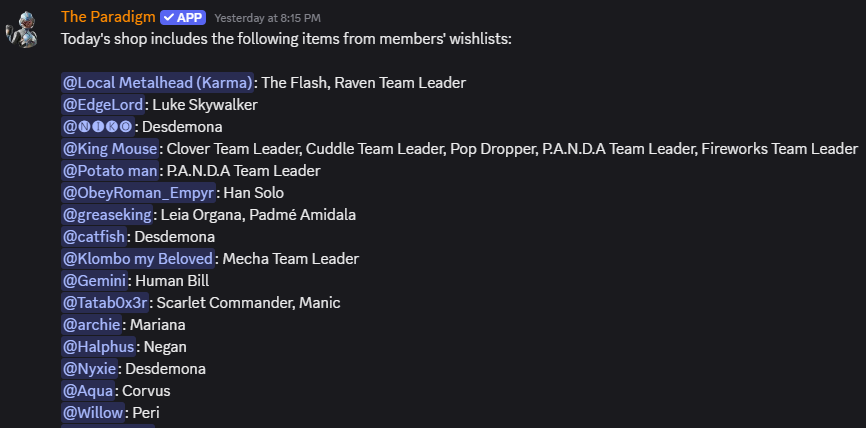

# The Paradigm

## About

A Fortnite-themed Discord bot with a variety of commands. Its official support server can be found [here](https://discord.gg/7m62WmKFCp).

## Setup

The developer-hosted invite link can be found [here](https://discord.com/api/oauth2/authorize?client_id=710314063892054016&permissions=274878024704&scope=applications.commands%20bot).

For self-hosting with all features, the bot's `src/config.ts` file should be of the following structure (filing out all properties as needed):

```ts
import type { Config } from './types.js';

const config: Config = { ... }; // Make object based on the Config interface

export default config;
```

The bot also relies on/makes use of the following permissions:

* View Channels
* Send Messages
* Send Messages in Threads
* Embed Links
* Attach Files
* Read Message History

## Commands

This is a non-exhaustive list of the bot's more unique commands that may require further explanation.

### /milestone

Various methods of managing milestones: achievements granted to members for completing feats. This command requires the user to have the Manage Server permission by default.

#### /milestone create

Create a milestone in the server.

#### /milestone delete

Delete a milestone from the server. This also removes the milestone from all members.

#### /milestone grant

Manually give a member a milestone.

#### /milestone list

List all of the available milestones in the server. This is part of the limited access `/milestone` command in case milestones are only meant to be seen by the server's moderators. As such, this command's response is ephemeral: only visible to its user.

### /milestones

List a member's milestones in the server. Unlike `/milestone`, this command requires no permissions by default.

### /settings

View and edit server-specific settings for The Paradigm. This command requires the user to have the Manage Server permission by default.

#### /settings edit

Set the shop section updates channel (sends new item shop section names before they release) and the wishlist channel (more below) for the server.


#### /settings view

View the amount of total giveaways, amount of total milestones, shop section updates channel, and wishlist channel for the server.

### /wishlist

Set up notifications when certain in-game cosmetics appear in the Fortnite item shop. This information is provided by [Fortnite-API](https://fortnite-api.com/) instead of directly querying the official Epic API. The wishlist announcements are sent in the channel set from the `wishlistchannel` option of `/settings edit`. **If the wishlist channel is not set, no members will be notified in that server.**



#### /wishlist add

Add a cosmetic to your wishlist. The available cosmetics are filtered to exclude non-item shop cosmetics, but the logic used to determine these may be incorrect, such as when non-battle pass cosmetics are internally tagged as battle pass exclusives. Please make the bot's owner aware of these issues, or make a pull request to allow these outliers to be added to the wishlists. Cosmetics cannot be added to the wishlist multiple times at once, but there is no limit to the amount of total wishlisted cosmetics.

#### /wishlist remove

Remove a cosmetic from your wishlist. You can re-add cosmetics your wishlist at any time.

#### /wishlist view

View the cosmetics in your wishlist in alphabetical order. Only the first 25 cosmetics are listed by name to improve readability, but the amount of overflowing cosmetics will be displayed. You will still receive notifications for overflowing cosmetics, and they can still be removed with `/wishlist remove`. You can also view the wishlist of other users, and it will be sent in an ephemeral message.

## Credits

Epic Games, Inc. retains all of the rights to the Fortnite intellectual property. This package makes use of Fortnite-API and other external libraries listed in the [package.json](package.json) file.
